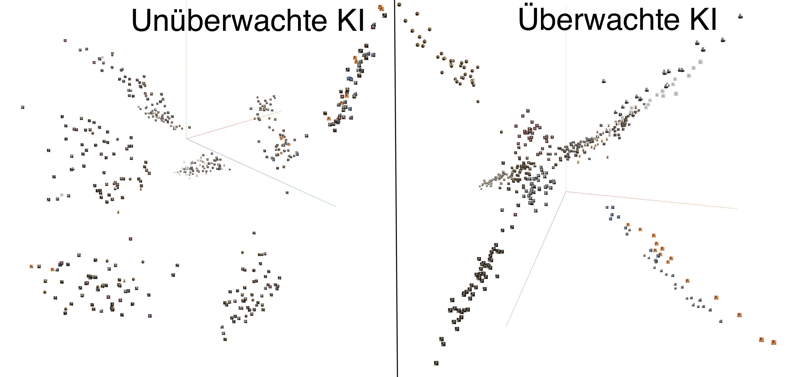
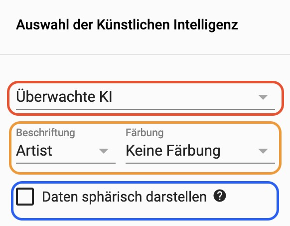
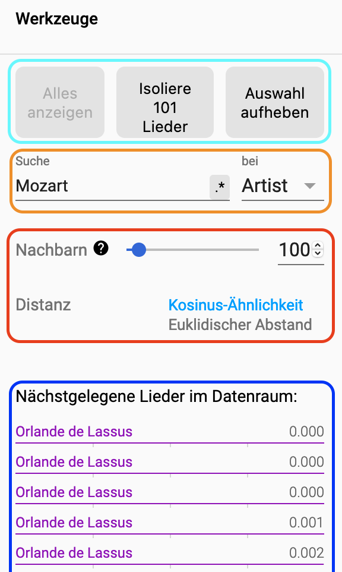
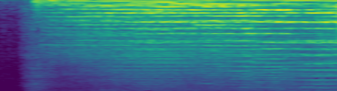

# Mozart Jukebox - Einführung

### Wie ähnlich ist Musik von Mozart, Bach oder Bruno Mars?
Menschliches Gehör erkennt sehr schnell Unterschiede zwischen Musikstücken. Kann ein Computer, genauer gesagt Künstliche Intelligenz (KI), das auch so einfach? Wenn ja, wie funk-tioniert das? Die Anwendung “Projekt Mozart Jukebox” zeigt Ihnen, wie ein Computer, wie eine KI, Komponisten und Künstler anhand ihrer Musik unterscheidet. Sie erfahren auch, wie Menschen Einfluss auf den Lernprozess und damit auf die Ergebnisse nehmen können. Viel Spaß! 

### Was ist die Mozart Jukebox?
Bei der Mozart Jukebox haben wir eine KI trainiert, 484 Musikstücke von 15 Komponisten und Musikern zu unterschieden, etwa wie Mozart oder Haydn aber auch Bruno Mars oder Michael Jackson. Die KI wurde so programmiert, dass sie ihre Interpretation der Musik dreidimensional darstellt und dadurch für das menschliche Auge sichtbar wird. 

### Blackbox KI – welchen Einfluss hat der Mensch?
Die KIs, die hier konzipiert und trainiert wurden, unterliegen zu einem Großteil menschlichen Entscheidungen. KI ist das Produkt eines Entwicklungsprozesses, der von Menschen gesteuert wird. Das Ergebnis ist daher abhängig von den Entscheidungen, die ein Mensch trifft. Durch die Mozart Jukebox können Sie das Zusammenspiel zwischen Mensch und KI sehen.

### Die KI sieht aber hört nicht! 
KI verwendet – anders als das menschliche Gehör – keine Klanginformationen, also Töne. Stattdessen wird eine sogenannte akustische Frequenzdarstellung über die Zeit verwendet. Das Ganze wird als Bild zusammengefasst und als Spektrogramm bezeichnet. Beispielsweise würde "Zauberflöte" von Wolfgang Amadeus Mozart so aussehen:

## Abhängig und gleichzeitig unabhängig vom Menschen. 
Wir verwenden in diesem Projekt zwei Arten von KIs: eine überwachte und eine unüberwachte KI. Beide versuchen, Stücke sinnvoll zusammenzufassen, etwa nach Künstler. Die überwachte KI hatte, während des Lernens, Zugriff auf Künstlerinformationen. Das heißt, das Stück oben stammt von Mozart. Dadurch konnte sie ihre Vorhersagen im Laufe des Trainings immer weiter verbessern. Stellen Sie sich vor, Sie würden eine Fremdsprache lernen und jemand gibt Ihnen Feedback zur korrekten Aussprache oder zur richtigen Wortwahl. 

Beim unüberwachten Prozess standen diese Informationen nicht zur Verfügung. Die KI musste während des Trainings selbst versuchen, für sich ähnliche Stücke zusammenzufassen und einer Kategorie zuzuordnen. Die Ergebnisse werden mit jedem Durchlauf weiter verbessert. 

## Überwacht/unüberwacht – Ergebnisse 
Bei der überwachten KI ist wichtig, dass die KI alle Musikstücke dem richtigen Künstler zuord-net. Dieser Prozess wird so oft wiederholt, bis die Ergebnisse zufriedenstellend sind. 

Bei der unüberwachten KI sollen die Musikstücke zusammengefasst und einer Kategorie zuge-ordnet werden. Festgelegt wird hier lediglich, wie viele Durchläufe es gibt. Aufgrund der feh-lenden Information werden auch Werke unterschiedlicher Künstler gruppiert und es können Wagner und Beethoven eng beieinander stehen; Werke von Mozart dagegen ganz unterschied-lich und weit auseinander liegend bewertet eingestuft werden. 

Das Ergebnis ist insgesamt unerwarteter und wirkt chaotischer. 

Das lädt zum Reflektieren ein: Welche Aspekte der Musikstücke hat die KI als wichtiger erach-tet als ich selbst? Würde ich die Lieder auch so zusammenfassen, wenn ich den Künstler nicht kennen würde? 

Wir, die FHWS, wünschen Ihnen viel Freude mit der Jukebox! 

# Bedienung

### Hauptsicht
Die Jukebox ist über die App und im Browser über https://mozart.fiw.fhws.de erreichbar. Nach dem Aufruf sehen Sie als Erstes das oben dargestellte Bild. Das ist die Sichtweise der KI auf die von uns ausgewählte Musik. Jedes Bild-Icon entspricht einem Musikstück. Die App können Sie wie gewohnt durch Touch oder Mausklick über Ihr Smartphone oder Ihren Computer be-dienen.

### Musikinfo und Player 
Über das Icon erhalten Sie weitere Informationen zum ausgewählten Musikstück: 

Sie können das Werk auch anhören: entweder in voller Länger, falls Sie in Ihrem Browser bei Spotify angemeldet sind, ansonsten nur einen kurzen Ausschnitt.

### Auswahl KI und Beschriftung

**Rot markiert**: Sie können in der App auswählen von welchem KI-Typ Sie die Sichtweise se-hen möchten. Dabei können Sie zwischen den Typen unüberwachte und überwachte KI ent-scheiden. 

**Orange markiert**: Bei der Darstellung in der Hauptsicht können Sie entscheiden, ob die klei-nen Bilder mit dem Künstlernamen, dem Album oder dem Liedtitel beschriftet werden sollen. Zusätzlich können Sie die Bilder nach Künstler färben lassen. 

**Blau markiert**: Die Daten sphärisch darzustellen heißt, kurz die Lieder auf einen Globus aufzu-tragen und darzustellen. 

### Werkzeuge und Suche 
Bei der Auswahl eines Musikstücks erscheint außerdem eine Werkzeugleiste: 
 

**Türkis markiert**: Die App selektiert nach der Auswahl eines Liedes automatisch die nächsten Lieder und markiert sie zusätzlich in der Hauptsicht. Diese Selektion kann auch isoliert betrach-tet werden und somit nur diese Lieder in der Hauptsicht angezeigt werden. 

**Orange markiert**: Über die Suchleiste können Sie nach Stücken suchen, etwa nach Namen des Stücks, Komponist oder Album.

**Rot markiert**: Über den Schieberegler können Sie festlegen, wie viele Nachbarn von der An-wendung automatisch ausgewählt werden sollen. Zudem können Sie festlegen, wie die App Nähe definieren soll. 

**Blau markiert**: Die nächsten 101 Stücke werden hier aufgelistet jeweils mit der zugehörigen Distanz zum ausgewählten Stück. 

# FAQ 

### Was sehe ich da? 
Die FHWS Jukebox ermöglicht es, die Perspektive einer Künstlichen Intelligenz (KI) auf Musik nachzuvollziehen. Ein Punkt im Video stellt ein Musikstück dar und wurde von der KI interpre-tiert. Dabei geht es vor allem um klassische Musik wie Mozart oder Haydn aber auch Michael Jackson ist dabei. Die KI wurde dazu trainiert, insgesamt 15 Künstler zu unterscheiden.

### Was meint Darstellung? 
Das KI-Programm wurde so programmiert, dass ihre Informationsdarstellung für die Unter-scheidung zwischen den Künstlern dreidimensional ist und dadurch für den Menschen mit blo-ßem Auge sichtbar wird.

### Wie lernt KI, Musik zu unterscheiden?
Diese KI verwendet keine Klang-informationen, sondern eine akustische Frequenzdarstellung über die Zeit zusammengefasst als Bild. Das Bild wird als Spektrogramm bezeich-net. Beispielsweise würde "Der Engel (Wesendonck Lieder, WWV 91)" von Richard Wagner so aussehen:

### Was meint KI?
Die hier verwendete Technik wird „Convolutional Neural Network“ (CNN) genannt. Ein CNN ist von der Wirkungsweise dem visuellen Cortex nachempfunden, wobei dies nur als Konzept zu verstehen ist. Ein CNN ist weit von der tatsächlichen Funktionsweise neuronaler Verarbei-tung entfernt. Es besteht aus mehreren aufeinander aufbauenden Schichten, wobei jede Schicht eine eigene Funktion besitzt. Beispielsweise geht es in den ersten Schichten des Netzwerks da-rum, grobe Strukturen, wie Kurven oder Linien, zu erkennen, während die letzten Schichten dafür zuständig sind, die Informationen der unteren Schichten zusammenzufassen und eine Ent-scheidung zu treffen. In dem Fall der Jukebox fasst die KI ihre Informationen in drei Dimensio-nen zusammen.

### Wie lernt die KI?
Neben dem oben gezeigten Bild wird der KI die Künstlerinformation mitgegeben, wie im Fall oben Richard Wagner. Die KI wird zufällig initialisiert und das Bild von der KI analysiert. Die Künstler-Entscheidung der KI wird mit dem tatsächlichen Künstler überprüft und die KI passt sich so an, dass seine Entscheidung beim nächsten Mal näher an dem tatsächlichen Künstler ist. Dieser Durchlauf wird so oft wiederholt, bis sich eine zufriedenstellende Vorhersage-Genauigkeit einstellt. 

### Was heißt Überwachte KI?
Die überwachte KI bekommt vom menschlichen Nutzer die Künstlerinformation bereitgestellt. Das bedeutet, dass innerhalb des Lernprozesses, die KI ein Bild analysiert und eine Vorhersage des Künstlers macht. Diese Vorhersage wird mit der tatsächlichen Künstlerinformation abgegli-chen und die KI verändert ihre Parameter so, dass sie beim nächsten mal eine bessere Vorhersa-ge trifft.

### Was heißt unüberwachte KI?
Anders als bei der überwachten KI, werden der unüberwachten KI keine Künstler-Informationen gegeben. Sie lernt, indem sie die Künstler aller Lieder vorhersagt und Lieder mit ähnlicher Künstler-Vorhersage zusammenfasst. Anschließend werden die jeweils zusammenge-fassten Lieder als eine Kategorie verwendet. Die KI lernt dabei beim nächsten Mal die zusam-mengefassten Lieder für sich besser vorherzusagen. Der menschliche Nutzer muss lediglich angeben wie viele Zusammenfassung die KI machen soll. 

### Wurde dieses Ergebnis erwartet?
Bei der überwachten KI wurde das Ergebnis so erwartet. Die KI unterscheidet aufgrund der Künstlerinformation alle Lieder sichtbar voneinander. Bei der unüberwachten KI wird ein Er-gebnis erwartet, bei dem alle Lieder zwar zusammenfasst, allerdings aufgrund der fehlenden Künstlerinformation, die Lieder unabhängig vom Künstler zusammengefasst werden. So entste-hen Zusammenfassungen, die Künstler vermischen. 

### Welche Relevanz hat das Ergebnis? 
Die KI wurde explizit darauf trainiert eine 3-dimensionale Sichtweise darzustellen, welche vom Menschen visuell erfasst werden kann. Dies ermöglicht dem Nutzenden das Denkmuster einzu-sehen und zu entscheiden, wie gut oder schlecht die KI aufgrund der Lieder lernt. Dabei ist das Ergebnis nicht fix, sondern kann durch Ändern der Einstellungen der KI angepasst werden. Bei der überwachten KI ist relevant, dass die KI tatsächlich alle Lieder zugehörig zum Künstler rich-tig fasst. Bei der unüberwachten KI ist relevant zu sehen, wie eine KI ohne den Einfluss vom Menschen arbeitet. Der Mensch kann das Ergebnis bewerten und sich Fragen stellen wie: Ist diese Interpretation korrekt? Warum ordnet die KI die Lieder aufgrund der Melodie der Lieder so ein? Kann ich dabei für meine eigene Interpretation etwas lernen? Wichtig dabei ist: Es gibt nicht die KI, sondern vielmehr ist die hier vorgestellte KI das Produkt eines Entwicklungspro-zesses gesteuert vom Menschen. Das Ergebnis ist daher abhängig von den menschlichen Ent-scheidungen.

# Weiterführende Inhalte 

### Einleitendes
Dieser Abschnitt beinhaltet eine Sammlung von weiterführenden Informationen für interessierte Nutzende. Dabei werden zwei Arten von weitergehenden Informationen zur Verfügung gestellt: Kurzinformationen für Basiswissen und erweiterte, zum Teil technische, Informationen zu der Thematik. 

### Convolutional Neural Network (KI)
Kurzerklärung: https://www.bigdata-insider.de/was-ist-ein-convolutional-neural-network-a-801246/
Erweiterte Inhalte: https://www.youtube.com/watch?v=OV0KXyYpEZY
Erweitere Technische Inhalte (Englisch): https://medium.com/@hasithsura/audio-classification-d37a82d6715

### Informationsgewinnnung Audiodaten
Kurzerklärung: https://de.wikipedia.org/wiki/Mel_Frequency_Cepstral_Coefficients 
Erweiterte konzeptionelle Inhalte (Englisch): http://practicalcryptography.com/miscellaneous/machine-learning/guide-mel-frequency-cepstral-coefficients-mfccs/
Erweiterte technische Inhalte (Englisch): https://towardsdatascience.com/getting-to-know-the-mel-spectrogram-31bca3e2d9d0

### Webapp - Tensorboard
Anbieterwebseite: https://www.tensorflow.org/tensorboard 
Kurze Einführung (Englisch): https://www.tensorflow.org/tensorboard

# Rechtliches, Datenschutz und Impressum
Rechtliche Informationen, Datenschutzerklärung sowie Impressum sind in der APP "Mozart & More" ([App Store](https://apps.apple.com/de/app/mozart-more/id1560225415) oder [Play Store](https://play.google.com/store/apps/details?id=de.augmentedart.mozartfest&hl=de&gl=US)) dargelegt. 